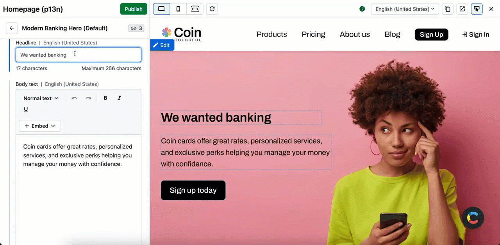
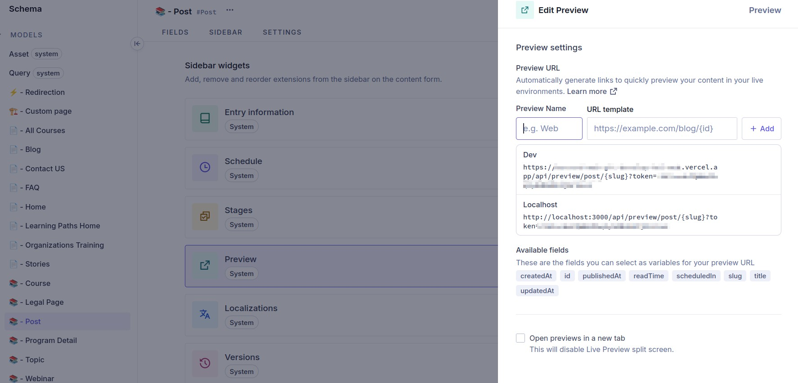
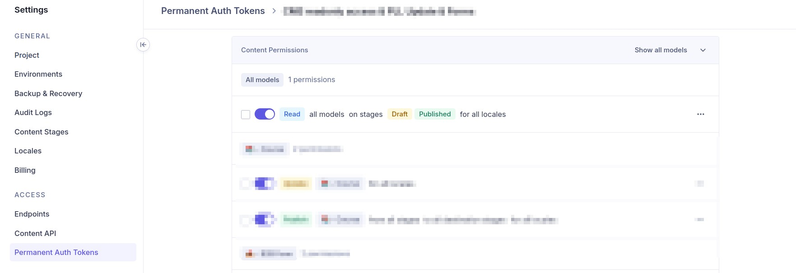

# Habilitar previews en un headless CMS's

## Introducción

Hablando de CMS's, una de las cosas que más demandan los editores (y de la que
siempre nos olvidamos los desarroladores) es la posibilidad de ver los previews
de sus contenidos en borrador antes de publicarlos.



Si estás usando un Headless CMS como Contentful, Hygraph o Strapi, puedes
habilitar previews de forma sencilla, aunque uses un build estático.

Primero vamos a ver como habilitar los previews en Next.js y Astro, y después
como conectar esto con tu headless CMS.

## Mostrar borradores en el frontend

### DraftMode en Next.js

Next.js maneja las previews de forma "nativa", con lo que es muy facil saber si
la página que estás renderizando está en modo "preview" o en producción.
Simplemente tienes que llamar a `draftMode()`. A partir de ese punto puedes usar
`isDraft` para decidir si pides el contendio en borrador o el publicado (eso lo
veremos más adelante, ya que depende de cada CMS).

```ts
import { draftMode } from "next/headers";

export async function MyBlogPost() {
  const isDraft = (await draftMode()).isEnabled;

  const { data } = await sdk.GetCustomPages({
    stage: isDraft ? Stage.Draft : Stage.Published,
  });
  //...
}
```

Para habilitar el modo draft en una petición. llama a `draftMode()).enable()` y
luego redirecciona a la página que te interese:

1. En el Headless CMS has configurado como URL de preview un endpoint de tu app
   Next.js. Por ejemplo `/api/preview`
2. En ese endpoint has configurado algo como lo siguiente, para habilitar el
   modo draft:

```ts
// src/pages/api/preview.ts

import { draftMode } from "next/headers";
import { redirect } from "next/navigation";

export async function GET() {
  (await draftMode()).enable();
  return redirect("/my-blog-post");
}
```

3. Cuando abres la preview y llamas al endpoint de arriba, el modo draft se
   activa en esa petición, con lo que al redireccionarte a al página ves su
   versión en borrador y no la publicada.

### DraftMode en Astro

Para usar esta funcionalidad en Astro, necesitas haber instalado astro en un
hosting que soporte SSR, como Vercel, y haberlo habilitado en tu proyecto.
Tienes más info al respecto en
https://docs.astro.build/es/guides/on-demand-rendering/

A partir de ahí, puedes crear endpoins nuevos destinados a las previews y
compartir su lógica con las páginas normales. Por ejemplo, tendríamos una página
normal en la que hemos separado el renderizado de contenido a un componente
externo:

```mdx
---
// src/pages/my-blog-post.astro

const data = fetchMyData(isPreview: false);
---

<BlogPostScreen data={data} />
```

De tal forma que podemos facilmente crear un endpoint para las previews:

```mdx
// src/pages/preview/my-blog-post.astro

export const prerender = false;

const data = fetchMyData(isPreview: true);

---

<BlogPostScreen data={data} />
```

Ahora, si nuestro CMS llama a `/preview/my-blog-post` se mostrará la versión en
borrador de la página `/my-blog-post`.

## Conectar con tu CMS

Esto es generalmente sencillo y se hace a través de la UI del CMS. Sin embargo
puede complicarse en algunos casos, por ejemplo cuando el CMS usa tokens
distintos para obtener los datos en borrador o publicados.

### Hygraph

En hygraph, para habilitar el preview de un contenido, por ejemplo un blog post,
tienes que ir al esquema de ese contenido y a "Sidebar". Ahí puedes activar el
widget de preview arrastrándolo a la parte central de la pantalla. Una vez hecho
esto puedes introducir las urls de preview que te interesen. Puedes añadir
campos del contenido, como `slug`, `id`, etc.



A partir de este momento dispondrás de un botón preview cuando edites el
contenido.

### ¿Cómo obtengo el contenido draft en mi frontend?

Deberás añadir el argumento `Stage` a tus queries:

```graphql
query GetPost($slug: String!, $stage: Stage! = PUBLISHED) {
  post(where: { slug: $slug }, stage: $stage) {
    ...Post
  }
}
```

Y luego llamarlas con el valor `DRAFT` en el frontend. Por ejemplo, en Next.js:

```ts
const { data } = await sdk.GetPost({
  slug: "my-blog-post",
  stage: (await draftMode()).isEnabled ? Stage.Draft : Stage.Published,
});
```

Recuerda, asegurarte que el token que uses tenga permisos para obtener contenido
en borrador.



### Contentful

El proceso es muy similar a Hygraph, pero en Contentful. Pimero debes ir
"Settings", "Content Preview" y crear una "Preview platform". A partir de ahí
seleccionas los "content types" a los que quieres añadir preview y vas
rellenando las urls, como en Hygraph.

Puedes acceder a propiedades del contenido, como `slug`, `id`, etc. para
incluírlos en la URL.

Una vez hecho esto, podrás ver un botón de "Preview" en el sidebar de la derecha
cuando editas el contenido.

### ¿Cómo obtengo el contenido draft en mi frontend?

Este caso es un poco complicado, porque Contenful usa tokens distintos para los
elementos en borrador y publicados. Sin embargo, como debemos pasar el parámetro
"preview" a las queries podemos usar eso para escoger uno u otro token.

1. Primero debemos añadir el parámetro "preview" a las queries, como el stage en
   Hygraph:

```graphql
query GetPost($slug: String!, $preview: Boolean = false) {
  post(where: { slug: $slug }, preview: $preview) {
    ...Post
  }
}
```

2. Pasar ese valor al llamar la query. Por ejemplo, en Next.js:

```ts
const { data } = await sdk.GetPost({
  slug: "my-blog-post",
  preview: (await draftMode()).isEnabled,
});
```

3. Modificar el cliente graphql para que use el token correcto. Por ejemplo, con
   graphql-request, usando un middleware:

```ts
import { GraphQLClient, RequestMiddleware } from "graphql-request";

import { getSdk } from "./generated";

const requestMiddleware: RequestMiddleware = (request) => {
  const token = !!(request.variables as { preview?: boolean })?.preview
    ? process.env.CONTENTFUL_PREVIEW_ACCESS_TOKEN!
    : process.env.CONTENTFUL_ACCESS_TOKEN!;

  (request.headers as Headers).append("Authorization", `Bearer ${token}`);
  return request;
};

const client = new GraphQLClient(
  `https://graphql.contentful.com/content/v1/spaces/${process.env.CONTENTFUL_SPACE_ID}/environments/${process.env.CONTENTFUL_ENVIRONMENT}`,
  {
    requestMiddleware,
  },
);

export const sdk = getSdk(client);
```

### Strapi

Strapi no incluye esta funcionalidad por defecto, pero es muy sencillo de
implementar. Debes instalar el plugin
[strapi-plugin-preview-button](https://market.strapi.io/plugins/strapi-plugin-preview-button)
y después añadir la configuración necearia en el archivo `config/plugins.ts`.
Por ejemplo, para un post de blog, con namespace _blog.blog_:

```ts
module.exports = ({ env }) => ({
  "preview-button": {
    enabled: true,
    config: {
      contentTypes: [
        {
          uid: "api::blog.blog",
          draft: {
            url: "https://www.mi-web.com/preview/blog/{documentId}",
          },
        },
      ],
    },
  },
});
```

## Resolución de problemas

### Mis previews no funcionan, me sale un error relativo a los iframes

Esto suele ser porque tu contenido no tiene permiso para ser mostrado en un
iframe dentro de la UI del CMS. Para corregir esto puedes añadir ese permiso en
el endpoint que usas para generar/redireccionar las previews.

Por ejemplo para Hygraph y Next.js:

```ts
// src/pages/api/preview.ts

import { draftMode } from "next/headers";
import { redirect } from "next/navigation";

export async function GET(request: NextRequest) {
  (await draftMode()).enable();

  requestHeaders.set(
    "Content-Security-Policy",
    "frame-ancestors 'self' https://*.hygraph.com",
  );

  return redirect("/my-blog-post");
}
```

En el caso de otro CMS deberías añadir aquí su dominio.

### Los endpoints de preview son públicos... ¿Cómo puedo añadir algo de seguridad?

En **Next.js** puedes añadir un token a la URL como parámetro GET. No es lo más
seguro, porque como las peticiones son GET, cualquiera que vea el tráfico de red
va a poder leer el token, pero nos añaden algo de protección contra bots y
spiders.

Simplemente añade esta validación a tu endpoint:

```ts
const { searchParams } = new URL(request.url);
const previewToken = searchParams.get("token");

if (previewToken !== process.env.API_PREVIEW_SECRET!) {
  return new Response("Invalid token", { status: 401 });
}
```

Y al configurar las previews en tu CMS añádelo a la URL:
`https://www.mi-web.com/preview/blog/{documentId}?token=MI_TOKEN`.

En el caso de **Strapi** puedes añadirlo directamente a la configuración del
plugin:

```ts
{
  uid: "api::blog.blog",
  draft: {
    url: "https://www.mi-web.com/preview/blog/{documentId}",
    query: {
        token: env('API_PREVIEW_SECRET')
    },
  }
}
```

En **Astro** lo validas de forma similar:

```mdx
----
const token = Astro.url.searchParams.get("token") || "";

if (token !== import.meta.env.API_PREVIEW_SECRET) {
  throw new Error("Invalid token");
}

---
```

### ¿Cómo puedo tener muchas previews de forma escalable en Next.js?

Puedes usar dos endpoints diferentes, uno para las previews de páginas generales
(por ejemplo la home) y otro para las vistas de detalle (por ejemplo un post).

Crea una estructura como esta:

```
/pages/
  /api/
    /preview/[type]
      [slug]
        route.tsx
      route.tsx
```

Define los content types en cada route, por ejemplo:

```ts
type ContentTypes = "contact-us" | "home" | "post" | "product";
```

Y luego en cada route puedes validar el tipo de contenido y redireccionar según
el caso:

```ts
// src/pages/api/preview/[type]/route.ts

export async function GET(
  request: NextRequest,
  { params }: { params: Promise<{ type: ContentTypes }> },
) {
  const { type } = await params;
  //...
  switch (type) {
    case "home":
      return redirect("/home");
    case "contact-us":
      return redirect("/contact-us");
    default:
      return new Response("Invalid content type", { status: 400 });
  }
}
```

```ts
// src/pages/api/preview/[type]/[slug]/route.ts

export async function GET(
  request: NextRequest,
  { params }: { params: Promise<{ type: ContentTypes; slug: string }> },
) {
  const { type, slug } = await params;
  //...
  switch (type) {
    case "post":
      return redirect(`/post/${slug}`);
    case "product":
      return redirect(`/product/${slug}`);
    default:
      return new Response("Invalid content type", { status: 400 });
  }
}
```
